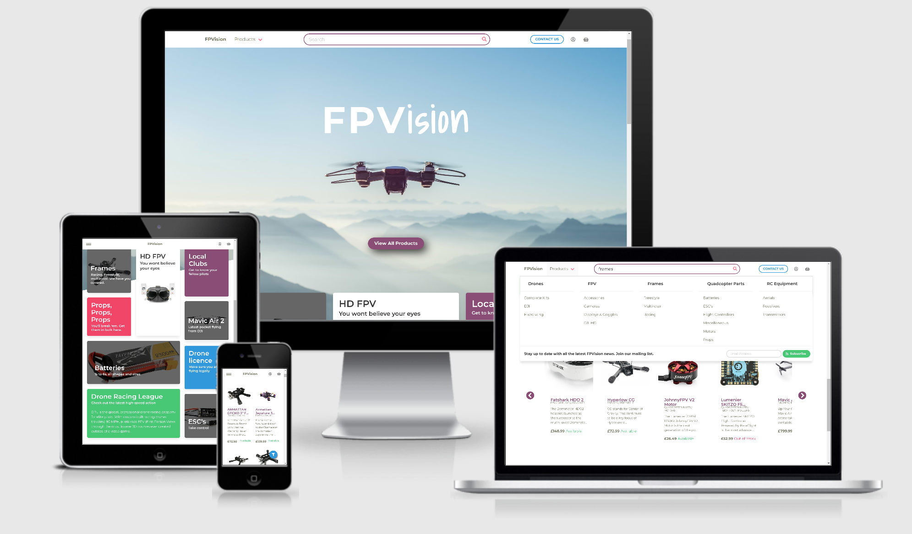
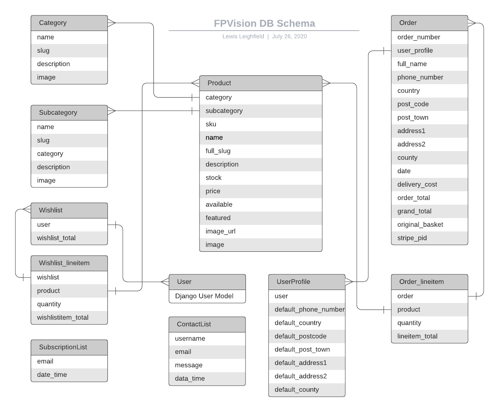

# FPVision

[](https://travis-ci.org/wrengit/FPVision)  [](https://codecov.io/gh/wrengit/FPVision) [](https://www.python.org/dev/peps/pep-0008/) [](https://github.com/alpinejs/alpine/)

A fictional e-commerce store for drone and FPV products. Python|Django backend with a Bulma|Sass|AlpineJS frontend.



## Demo

A link to the project hosted on Heroku can be found [here](https://fpvision.herokuapp.com).

## Contents

1. [**UX**](#ux)
    * [**Project Aim**](#project-aim)
    * [**User Stories](#user-stories)
    * [**Design Decisions**](#design-decision)
    * [**Wireframes**](#wireframes)

2. [**Code**](#code)
    * [**Settings**](#settings)
    * [**File Structure**](#file-structure)
    * [**Static Files**](#static-files)
    * [**DB Schema**](#db-schema)

3. [**Features**](#features)
    * [**Existing Features**](#existing-features)
    * [**Features Left to Implement**](#features-left-to-implement)

4. [**Languages**](#languages)

5. [**Technologies Used**](#technologies-used)

6. [**Services Used**](#services-used)

7. [**Testing**](#testing)
    * [**Unit Tests**](#unit-tests)
    * [**CI**](#ci)
    * [**Functionality**](#functionality)
    * [**Usability**](#usability)
    * [**Compatability**](#compatibility)
    * [**Security**](#security)
    * [**Accessability**](#accessibility)

8. [**Cloning and Deployment**](#cloning-and-deployment)
    * [**Cloning**](#cloning)
    * [**NodeJS**](#nodejs)
    * [**Poetry**](#poetry)
    * [**Deployment**](#deployment)

9. [**Credits**](#credits)
    * [**Inspiration**](#inspiration)
    * [**Media**](#media)
    * [**Guides and Resources**](#guides-and-resources)
    * [**Code**]

## UX

### Project Aim

The main focus of this project was do delivery a user friendly e-commerce store that was easy to navigate. The main landing page displays a tile arrangement which allows the store owner/admin to bring immediate attention to specific products, categories or articles. These are attention grabbing, displayed with full sized images or bold colours.

The main/index page has external links to useful resources for drone pilots. The idea is that the site may be bookmarked by the user, knowing that they can access these links, and allowing for potential sales whilst the user is on the site.

A prominent link on the hero image allows users to head straight to the main products view.

The main product view is displayed in a card arrangement and the user has the ability to sort the product by price. There are two ways to navigate to the desired products, with a drop down product menu within the nav bar, and a breadcrumb style links menu at the top of the products page.

The colour scheme was chosen to liven up and contrast to the predominantly white backgrounds without distracting or clashing. The primary colour(#8A4D76) and the link colour(#FA7C91) are complimentary.

The entire colour scheme can be changed very easily simply by change a handful of variables in `_custom_bulma.sass`. This allows the store owner/admin to change the look of the site to match promotions or special events.

A fixed navigation bar was chosen to ensure the user always has access to the main product dropdown and the search bar.

A selection of featured products is also found on every page. These are displayed in a horizontally scrolling container, with a clearly indicated clickable arrow on either side on desktop, and swipable for touch devices. On mobile devices, it is becoming more common to find these horizontal scrolling containers, and allows for better user experience when viewing related items.

Each product has its information clearly presented, including availability.
Two buttons are displayed allowing the user to add to their basket and add to a wishlist. The basket option is more prominent, with a bolder colour and showing first/left. This encourage the user to buy, rather than save the item for later.

If a product is out of stock, the option to add to basket or wishlist is removed.

Feedback is given to the user on every major action taken in the form of a message 'toast'.

On desktop, the user can hover over the basket icon to quickview the products in contains, with a button link to checkout the order or view the basket.
The basket icon changes colour when it contains items, and also displays the product count in the familiar red circle.

The site uses humans readable urls, to aid in navigation and increase SEO rankings.

### User stories

<details>
  <summary>Click to expand</summary>
  
>As a user browsing across the site, I want to immediately understand what the shop is selling
>
>>Large, image heavy front page to invite users and show some key products
---
>As a shopper I want to view a list of products so I can select some to purchase
>
>>Image for each product  
>>Clicking image/product to show more details  
>>Easily add item to cart from main page and detail page  
>>Search for products  
>>View products by category
---
>As a shopper I want to view my cart to see total and make adjustments
>
>>View quantities and items in cart  
>>See total cost before and after shipping  
>>Remove items  
>>Adjust quantity of items  
>>Click on item in cart to view details
---
>As a shopper I want to easily checkout and pay for cart
>
>>Checkout button easily accessible to complete purchase  
>>Enter a shipping address  
>>Enter credit card details  
>>Show total including all extra charges before confirmation  
>>Show confirmation message when completing transaction
---
>As a shopper I want to view a list of past orders
>
>>View a list of past orders  
>>Include an order number to easily find order
---
>As shop admin I want to easily add products to the site
>
>>Add or remove products  
>>Delete products

</details>

### Design Decisions

* In the user profile section, once a user in logged in, there is a dashboard for the user to set or change their personal information. The user may also view their wishlist in this location.

* It was a conscious decision to omit pagination on the main product page. Mobile browser usage is increasing year on year, and having to click and load a new page every 'x' amount of displayed items is cumbersome. With lazy-loading on the images, the entire product catalog can be loaded in one view without a large delay in load times. This may increase as the product catalog grows and may need to be evaluated at a later date and based on user feedback.

The live product filter also works better with all product displayed on a single view.

### Wireframes

A link to the wireframes can be found [here](FPVision(wireframes).pdf).

### Settings

The main application settings are found in the 'FPVison' app as `settings.py`.
All secret keys and API keys were stored locally in a .env file and as environment variables set in Heroku.
The custom settings are commented in `settings.py` and are as follows:

* AllAuth - The Django AllAuth settings specify authentication requirements for the application. These can be tailored to suits the needs of the store owner.

* AWS settings look for a variable, `PRODUCTION` in os.environ. This variable is set in Heroku. This switches the app to look for static files on AWS servers.

* Delivery Values - These settings set the free delivery threshold and are used in the checkout app. These settings can be changed to the store owners choice.

* Stripe settings are simply the currency choice and secret keys used.

* Django-countries - Changes how django-countries displays information in the country select box. Current settings show 'GB' at the top of the list for easier selection by the user.

* Email settings - If `PRODUCTION` in os.environ, the application uses the smtp backend and Gmail to send live emails

### File Structure

The project is broken down into 'apps', with each app performing a specific function. The app names are clear and self descriptive. Each app is self contained, with models, forms, tests, urls, static files, and views.

Each app uses one of more templates which extend the base.html template found in the project root 'templates' folder.

The site's CSS was written in Sass and compiled to the main 'static' folder.

### Static Files

The deployed site has static files hosted on AWS. These include all images, the CSS file, and JS files.

### DB Schema



The site uses the Heroku Postgres addon to utilise a Postgres DB.
The DB schema can be found in the image above, showing the relationships between the models.

## Features

### Exisiting Features

* Admin - There are two levels of admin accounts. The first is the global super user account which allows access to Django admin panel. This would be reserved for the IT admin and/or store owner. This allows significant changes to the site, including models and so is not suitable for non-tech staff. A group, 'admin' was created with permissions for CRUD operations on the 'Product' model. This allows non-tech staff to log on the  frontend of the site and easily add products, as well as edit existing product directly from the product page. The 'admin' has no way of making mistakes that may affect the stability of the site or its DB.

* Wishlist - The user has the option to add products to a wishlist if they are logged in. This is saved on the users profile, and can be viewed and amended from their 'Dashboard'. The user may add all products from their wishlist to their basket. This will remove the items from the wishlist, and retain any items that were previously in the basket.

* Search - The user may use the search bar to find a specific product. This searches product names, as well as description and categories. The search is live, filtering results as the user types for instant feedback. The user may either select a product from the live search, or hit enter/return to bring up a search page. The number of results and the search query are presented on both the live search and the search page.

* Checkout - The site uses Stripe as a payment processor. The checkout app currently uses a 'test' key, and as such will not process real payments. To test the payment process, the following card details can be used: `4242 4242 4242 4242`. Any date in the future for the expiry date, and  cvc number can be used. Please note that as this is an American test card, a 5 digit zipcode will be required, this can be any 5 numbers, but is required for the card to authenticate.

A webhook handler has been implemented to receive webhooks from the Stripe API should the user close their browser or lose connection after the payment has been submitted, but before the order has been created on the site DB. This allows creation of the order in the DB to ensure that customer orders are not missed in edge cases.

* Contact and Subscription Lists - The site has a 'contact us' button, allowing users, both guests and logged in users, to send a message to the site owners/admin. The subscription List is simply a list of emails of users that wish to subscribe. No further functionality has been coded.

### Features Left to Implement

* Each product has a stock level, which currently is not tied in to a stock management system. When a user places an order, this order is not deducted from the stock levels on the product.
* The ability for a store owner/admin to mark orders as dispatched, and a feed back email/status notification sent to the user.
* Full unit tests for all apps
* An option for a user to choose to be notified when an out of stock item is back in stock.
* Ability for a user to fully checkout as a guest user (not logged in) and then save that information to register an account. Currently if the user wishes to save the shipping info, they must already be logged in a verified.
* A blog section with useful articles and information

## Languages

* **Python** :snake:
* **JavaScript**
* **HTML**
* **CSS**

## Technologies Used

* [Django](https://www.djangoproject.com/) - A high-level Python Web framework
* [Sass](https://sass-lang.com/) - CSS extension language
* [NodeJS](https://nodejs.org/en/) - JavaScript runtime
* [NPM](https://www.npmjs.com/) - Node package manager
* [Bulma](https://bulma.io/) - CSS framework based on Flexbox
* [AlpineJs](https://github.com/alpinejs/alpine) - Minimalist JS framework
* [AWS](https://aws.amazon.com/) - Cloud infrastructure provider
* [Poetry](https://github.com/python-poetry/poetry) - Package manager with virtual envs
* [Gunicorn](https://gunicorn.org/) - WSGI HTTP server
* [Coverage](https://coverage.readthedocs.io/en/coverage-5.2.1/) - A tool for measuring code coverage of Python programs
* [Codecov](https://codecov.io/) - Tool for assessing code coverage
* [Pillow](https://python-pillow.org/) - A fork of Python Imaging Library
* [Django-aullauth](https://django-allauth.readthedocs.io/en/latest/index.html) - Django authentication toolset
* [Stripe](https://stripe.com/gb) - Payment infrastructure
* [Django-countries](https://pypi.org/project/django-countries/) - Provide country choices for use in forms
* [Boto3](https://boto3.amazonaws.com/v1/documentation/api/latest/index.html) - AWS SDK for Python
* [TravisCI](https://travis-ci.org/) - Continuous integration provider
* [Heroku](https://heroku.com) - Cloud services provider

## Services Used

* [Compress or Die](https://compress-or-die.com/) - Amazing image compression tool
* [Unsplash](https://unsplash.com/) - Image repository
* [favicon.io](https://favicon.io/) - Favicon & logo generator
* [Font Awesome](https://fontawesome.com/) - Huge selection of icons
* [Google Fonts](https://fonts.google.com/) - Fonts by Google
* [Shield.io](https://shields.io/) - Handy shield generator

## Testing

Code was put through flake8 python linter to conform to pep8 styling.

### Unit Tests

Unit tests were written for the following apps:

* contact
* index
* products
* profiles
* search

Coverage was used to determine code coverage and codecov for detailed reports on the coverage. Code coverage is displayed in a badge at the top of this README and currently stands at 61%.

The following apps do not have unit tests written yet:

* basket
* checkout
* wishlist

This is purely due to time restraints, with the tests due to be written when time allows.

### CI

Travis was chosen as the CI provider. Results for the units testing can be found [here](https://travis-ci.org/wrengit/FPVision). The `.travis.yaml` file is used to configure Travis, and requires Poetry to be installed and for Poetry to export the dependencies as `requirements.txt`.

The deployment on Heroku is configured to automatically deploy from the master branch, but only if the CI build passes. This ensures that no bugs get deployed to the production server.

### Functionality

The site was extensively manually tested by myself and a selection of other users to ensure that all functions performed as expected.

### Usability

Feedback from the user test group was used to make improvements in usability, such as using icons to indicate where horizontal scrolling was used.

### Compatibility

The site was developed on a Dell XPS 13 13" 2-in-1 touch screen laptop. Initial testing was conducted with Brave Browser, Microsoft Edge, and Chrome. Mobile testing used a Huawei P20 pro, using Brave, Chrome, and Firefox. There was no availability of Apple devices, either mobile or desktop to conduct testing.

Screen sizes were testing using the browser devtools, and tested down to iPhone 6 size to ensure the site stayed responsive.

### Security

The site has been designed defensively, redirecting users without the correct permissions who may attempt to access parts of the site by manually editing the url string. Admin functions are only displayed to users with the correct permissions.

### Accessibility

The site uses suitable aria-labels and alt texts for all images. Site was checked against the WAVE accessabilty checked and recommendations applied where approriate.

## Cloning & Deployment

### Cloning

The site was developed using VSCode.

The site can be cloned to a local repository by the following steps (GitHub guide link [here](https://help.github.com/en/articles/cloning-a-repository)):

* Under the repository name, click Clone or download.

* In the Clone with HTTPs section, click the clipboard icon to copy the clone URL for the repository.

* Open the terminal on your local machine

* Change the current working directory to the location where you want the cloned directory to be made.

* Type `git clone`, and then paste the URL you previously copied.

`$ git clone https://github.com/wregit/FPVision`

* Press Enter. Your local clone will be created.

```Bash

> Cloning into `Spoon-Knife`...
> remote: Counting objects: 10, done.
> remote: Compressing objects: 100% (8/8), done.
> remove: Total 10 (delta 1), reused 10 (delta 1)
> Unpacking objects: 100% (10/10), done.

```

### NodeJS

The site has packages that depend on NodeJS. Download Node with `pip install node`.
Using the terminal, navigate to `/sass/bulma/` (where you will find the package.json file) and run `npm install`. This will install the base Bulma files required.

### Poetry

This repo uses Poetry as the python package manager. Do not install Poetry using pip as this may cause conflicts. Poetry provides a custom installer that is isolated from the rest of your system by vendorizing its dependencies.

Open a terminal and use `curl -sSL https://raw.githubusercontent.com/python-poetry/poetry/master/get-poetry.py | python` to install.

Once poetry is installed, navigate to the project root in the terminal (same location as the pyproject.toml file) and run `poetry build`. This will install all the required dependencies.

### Deployment

To deploy this site to Heroku, follow these steps:

1. Ensure you have signed up to Heroku, and log in
2. From the Heroku dashboard, find the 'New' button in the top right and give your app a name and select a regional server.
3. In the 'settings' tab, ensure any environment variables have been set. These can be found in the 'Reveal Config Vars' section. For this application these include:  
    * `AWS_ACCESS_KEY_ID` - AWS keys generated on the AWS platform
    * `AWS_SECRET_ACCESS_KEY`
    * `DATABASE_URL` - Postgres db URL used for the Heroku DB addon
    * `EMAIL_HOST_PASS` - Gmail keys generated in Gmail
    * `EMAIL_HOST_USER`
    * `SECRET_KEY` - The Django Secret Key, found in FPVision/settings.py
    * `STRIPE_PUBLIC_KEY` - Stripe keys generated in Stripe
    * `STRIPE_SECRET_KEY`
    * `STRIPE_WH_SECRET`
    * `PRODUCTION` - A special variable to tell the server to run in production mode
  
4. The site can either be deployed directly from Heroku, if linked with a GitHub repo, or pushed to Heroku from the terminal.
    * To push from terminal, install the Heroku [CLI](https://devcenter.heroku.com/articles/heroku-command-line)
    * Login to Heroku `$ heroku login` and enter your Heroku details
    * `$ git push heroku master`

## Credits

This site is intended for education purposes only, and is not a commercial venture.

### Inspiration

The sites design is heavily inspired by [Unmannedtech](https://unmannedtech.co.uk), an online drone shop based in the UK. This was purely visual, and no code was copied from the site's source.

### Code

The basket and checkout app code is predominantly the work of [ckz8780](https://github.com/ckz8780),  who wrote the Django E-commerce module for the Code Institute. All other work was by me, except where detailed; Comments in the code detail where code snippets have been used, often from Stack Overflow. URL links have been provided to the original content to compare.

### Media

Product images and descriptions are not my own work. Product images and descriptions were sourced from the manufacturers site where possible, and from the following sites:

* [Unmannedtech](https://unmannedtech.co.uk)
* [Quadcopter](https://quadcopters.co.uk)
* [Firstpersonview](http://firstpersonview.co.uk)

The main page hero image was sourced from [Unsplash](https://unsplash.com) and the photo is credited to [asoggetti](https://unsplash.com/@asoggetti)

### Guides and Resources

I used the following resources to learn how to make this project:

* ckz8780's excelent Django module produced for the Code Institute
* Youtube videos by [Dennis Ivy](https://www.youtube.com/channel/UCTZRcDjjkVajGL6wd76UnGg)
